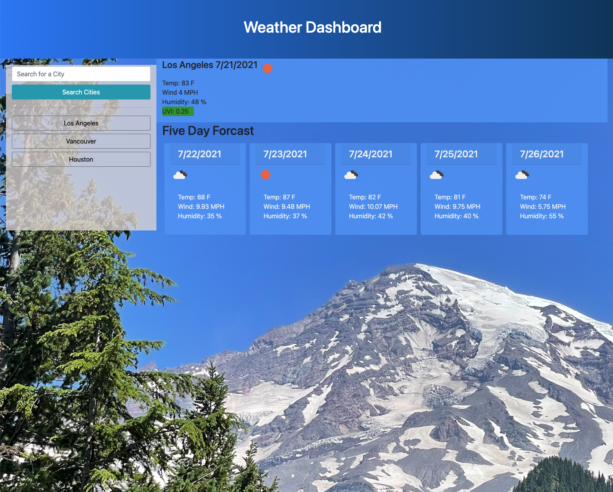

# Weather Dashboard

## About The App

The Weather Dashboard provides the user the ability to search for a city by name and it will display the current forcast for the city as well as the five day forcast. The app will display the cities searched and the user can click a button to switch to a previously searched city. If the city being searched is not currently in the history, then it will be added to the history and a new button added for it. The buttons are ordered by the last searched city. 

## How To Used

To start using the app, enter a city in the search field and click the Search City button. You can also click the city buttons for quick access to a previously searched cities. 

## Technologies Used

The following technologies were used to develop the dashboard

* CSS 
    * CSS was used for the styling of the app
    * Layout was mostly done using Bootstrap
    * Responsiveness was done using Bootstrap

* HTML
    * HTML was used for creating the overall webpage
    * Static elements were declared in the HTML file
    * elements that were repeating (the history buttons and five day forcast) were not 

* JavaScript
    * JavaScript was used to handle most of the work required 
    * API calls using the fetch method
    * JQuery to add elements and mainpulate the DOM
    * The [OpenWeather One Call API](https://openweathermap.org/api/one-call-api) was used to retrieve the forcast for the city under search
## Sample Output

The following image shows the web application's appearance and functionality:

## How To Access
The Weather Dashboard can be accessed [here](https://rashir01.github.io/ForecastMe/)

- - -
© 2021 Ray Ashir
